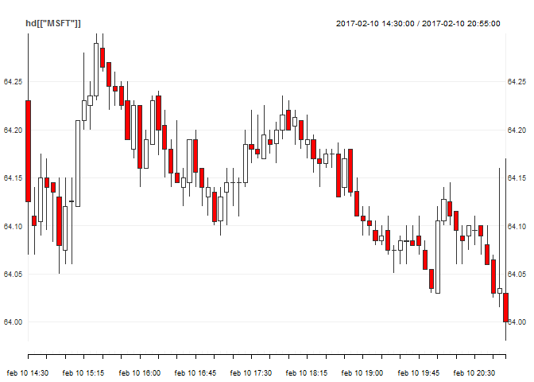

<!-- README.md is generated from README.Rmd. Please edit that file -->
robinhood
=========

[Robinhood](https://robinhood.com/company/) is here to democratize access to the financial markets. This is an R package to help with that.

This package is made based on the [unofficial documentation](https://github.com/sanko/Robinhood/) so it might have a few rough edges.

I have only implemented the parts of the API where authentication isn't needed, since I can't open an account. Please feel free to add the missing functionality.

### Issues

-   The time zones are still a bit of a mystery to me, which is why I've just used UTC for now.
-   All the requests that require authentication are not implemnted.

### Current functionality

-   Get the last quote: (`rh_quote`)
-   Historical quotes: (`rh_historicals`)
-   Meta info on markets: (`rh_markets`)
-   Get the market hours for a specific market: (`rh_market_hours`)
-   Get all the instruments (the api returns paginated results, so it might take a while to download): (`rh_instruments`)
-   Instruments fundamentals: (`rh_instruments_info`)
-   Instruments splits: (`rh_instruments_split`)
-   instruments keyword search: (`rh_instruments_search`)

### A few examples

Let's see how it works. Load the package and set the symbols.

``` r

library(robinhoodr)
library(quantmod)

symbols <- c("MSFT", "FB")
```

#### Historical data

Let's get some intraday data. The query below returns a list of length two with xts objects.

The function will make a request to the API for each individual symbol, soo if there are many symbols it can take a while.

``` r

hd <- rh_historicals(symbols = symbols, 
                     interval = "5minute", 
                     span = "day", 
                     bounds = "regular", 
                     keep_meta = FALSE, 
                     to_xts = TRUE)

str(hd)
#> List of 2
#>  $ MSFT:An 'xts' object on 2017-02-10 14:30:00/2017-02-10 20:55:00 containing:
#>   Data: num [1:78, 1:5] 64.2 64.1 64.1 64.2 64.1 ...
#>  - attr(*, "dimnames")=List of 2
#>   ..$ : NULL
#>   ..$ : chr [1:5] "open_price" "close_price" "high_price" "low_price" ...
#>   Indexed by objects of class: [POSIXct,POSIXt] TZ: UTC
#>   xts Attributes:  
#> List of 2
#>   ..$ session     : chr [1:78] "reg" "reg" "reg" "reg" ...
#>   ..$ interpolated: logi [1:78] FALSE FALSE FALSE FALSE FALSE FALSE ...
#>  $ FB  :An 'xts' object on 2017-02-10 14:30:00/2017-02-10 20:55:00 containing:
#>   Data: num [1:78, 1:5] 134 134 134 134 134 ...
#>  - attr(*, "dimnames")=List of 2
#>   ..$ : NULL
#>   ..$ : chr [1:5] "open_price" "close_price" "high_price" "low_price" ...
#>   Indexed by objects of class: [POSIXct,POSIXt] TZ: UTC
#>   xts Attributes:  
#> List of 2
#>   ..$ session     : chr [1:78] "reg" "reg" "reg" "reg" ...
#>   ..$ interpolated: logi [1:78] FALSE FALSE FALSE FALSE FALSE FALSE ...
```

Use quantmod to plot the Microsoft data.

``` r

print(chart_Series(x = hd[["MSFT"]]))
```



You can't get more than a years worth of historical data. I don't know if [Robinhood](https://support.robinhood.com/hc/en-us/articles/210216823-Robinhood-API-Integrations) might change that. In the example below a list with data frames are returned.

``` r

hd_daily <- rh_historicals(symbols = symbols, 
                           interval = "day", 
                           span = "year", 
                           bounds = "regular")

str(hd_daily)
#> List of 2
#>  $ MSFT:'data.frame':    251 obs. of  8 variables:
#>   ..$ begins_at   : POSIXct[1:251], format: "2016-02-16" ...
#>   ..$ open_price  : num [1:251] 49.9 50.5 51.3 50.9 51.2 ...
#>   ..$ close_price : num [1:251] 50.1 51.4 51.2 50.8 51.6 ...
#>   ..$ high_price  : num [1:251] 50.1 51.7 51.9 51.2 52 ...
#>   ..$ low_price   : num [1:251] 49.1 50.4 51.1 50.5 51.2 ...
#>   ..$ volume      : int [1:251] 37291208 40788968 27176035 33559073 25008291 28895274 33014457 26939467 35975925 31654036 ...
#>   ..$ session     : chr [1:251] "reg" "reg" "reg" "reg" ...
#>   ..$ interpolated: logi [1:251] FALSE FALSE FALSE FALSE FALSE FALSE ...
#>  $ FB  :'data.frame':    251 obs. of  8 variables:
#>   ..$ begins_at   : POSIXct[1:251], format: "2016-02-16" ...
#>   ..$ open_price  : num [1:251] 104 102 106 103 105 ...
#>   ..$ close_price : num [1:251] 102 105 103 105 107 ...
#>   ..$ high_price  : num [1:251] 104 106 106 105 108 ...
#>   ..$ low_price   : num [1:251] 100 100 103 102 105 ...
#>   ..$ volume      : int [1:251] 45687224 44073369 29593508 32404516 35709714 25319315 34412437 29906278 26686193 32778992 ...
#>   ..$ session     : chr [1:251] "reg" "reg" "reg" "reg" ...
#>   ..$ interpolated: logi [1:251] FALSE FALSE FALSE FALSE FALSE FALSE ...
```

You can decide to keep the meta data from the API request but only if the nested historical data is a data.frame.

``` r

hd_daily <- rh_historicals(symbols = symbols, 
                           interval = "day", 
                           span = "year", 
                           bounds = "regular", keep_meta = TRUE)

str(hd_daily)
#> List of 2
#>  $ MSFT:'data.frame':    1 obs. of  7 variables:
#>   ..$ quote      : chr "https://api.robinhood.com/quotes/50810c35-d215-4866-9758-0ada4ac79ffa/"
#>   ..$ symbol     : chr "MSFT"
#>   ..$ interval   : chr "day"
#>   ..$ span       : chr "year"
#>   ..$ bounds     : chr "regular"
#>   ..$ instrument : chr "https://api.robinhood.com/instruments/50810c35-d215-4866-9758-0ada4ac79ffa/"
#>   ..$ historicals:List of 1
#>   .. ..$ :'data.frame':  251 obs. of  8 variables:
#>   .. .. ..$ begins_at   : POSIXct[1:251], format: "2016-02-16" ...
#>   .. .. ..$ open_price  : num [1:251] 49.9 50.5 51.3 50.9 51.2 ...
#>   .. .. ..$ close_price : num [1:251] 50.1 51.4 51.2 50.8 51.6 ...
#>   .. .. ..$ high_price  : num [1:251] 50.1 51.7 51.9 51.2 52 ...
#>   .. .. ..$ low_price   : num [1:251] 49.1 50.4 51.1 50.5 51.2 ...
#>   .. .. ..$ volume      : int [1:251] 37291208 40788968 27176035 33559073 25008291 28895274 33014457 26939467 35975925 31654036 ...
#>   .. .. ..$ session     : chr [1:251] "reg" "reg" "reg" "reg" ...
#>   .. .. ..$ interpolated: logi [1:251] FALSE FALSE FALSE FALSE FALSE FALSE ...
#>  $ FB  :'data.frame':    1 obs. of  7 variables:
#>   ..$ quote      : chr "https://api.robinhood.com/quotes/ebab2398-028d-4939-9f1d-13bf38f81c50/"
#>   ..$ symbol     : chr "FB"
#>   ..$ interval   : chr "day"
#>   ..$ span       : chr "year"
#>   ..$ bounds     : chr "regular"
#>   ..$ instrument : chr "https://api.robinhood.com/instruments/ebab2398-028d-4939-9f1d-13bf38f81c50/"
#>   ..$ historicals:List of 1
#>   .. ..$ :'data.frame':  251 obs. of  8 variables:
#>   .. .. ..$ begins_at   : POSIXct[1:251], format: "2016-02-16" ...
#>   .. .. ..$ open_price  : num [1:251] 104 102 106 103 105 ...
#>   .. .. ..$ close_price : num [1:251] 102 105 103 105 107 ...
#>   .. .. ..$ high_price  : num [1:251] 104 106 106 105 108 ...
#>   .. .. ..$ low_price   : num [1:251] 100 100 103 102 105 ...
#>   .. .. ..$ volume      : int [1:251] 45687224 44073369 29593508 32404516 35709714 25319315 34412437 29906278 26686193 32778992 ...
#>   .. .. ..$ session     : chr [1:251] "reg" "reg" "reg" "reg" ...
#>   .. .. ..$ interpolated: logi [1:251] FALSE FALSE FALSE FALSE FALSE FALSE ...
```

### Quotes

Get the latest quote.

``` r

str(rh_quote(symbols = symbols))
#> 'data.frame':    2 obs. of  14 variables:
#>  $ ask_price                      : chr  "64.2400" "134.3900"
#>  $ ask_size                       : int  20100 300
#>  $ bid_price                      : chr  "64.1000" "134.1500"
#>  $ bid_size                       : int  100 3000
#>  $ last_trade_price               : chr  "64.0000" "134.1900"
#>  $ last_extended_hours_trade_price: chr  "64.0000" "134.3900"
#>  $ previous_close                 : chr  "64.0600" "134.1400"
#>  $ adjusted_previous_close        : chr  "64.0600" "134.1400"
#>  $ previous_close_date            : POSIXct, format: "2017-02-09" "2017-02-09"
#>  $ symbol                         : chr  "MSFT" "FB"
#>  $ trading_halted                 : logi  FALSE FALSE
#>  $ last_trade_price_source        : chr  "consolidated" "consolidated"
#>  $ updated_at                     : POSIXct, format: "2017-02-13 12:03:45" "2017-02-13 12:11:15"
#>  $ instrument                     : chr  "https://api.robinhood.com/instruments/50810c35-d215-4866-9758-0ada4ac79ffa/" "https://api.robinhood.com/instruments/ebab2398-028d-4939-9f1d-13bf38f81c50/"
```

#### Markets

Get info on the markets. The last time I looked it up there were about 14 exchanges, so this must be the exchanges Robinhood use to execute the transactions.

``` r

# List markets
str(rh_markets())
#> 'data.frame':    6 obs. of  10 variables:
#>  $ website      : chr  "www.otcmarkets.com" "www.nyse.com" "www.nyse.com" "www.nyse.com" ...
#>  $ city         : chr  "New York" "New York" "New York" "New York" ...
#>  $ name         : chr  "Otc Markets" "NYSE Mkt Llc" "NYSE Arca" "New York Stock Exchange, Inc." ...
#>  $ url          : chr  "https://api.robinhood.com/markets/OTCM/" "https://api.robinhood.com/markets/XASE/" "https://api.robinhood.com/markets/ARCX/" "https://api.robinhood.com/markets/XNYS/" ...
#>  $ country      : chr  "United States of America" "United States of America" "United States of America" "United States of America" ...
#>  $ todays_hours : chr  "https://api.robinhood.com/markets/OTCM/hours/2017-02-13/" "https://api.robinhood.com/markets/XASE/hours/2017-02-13/" "https://api.robinhood.com/markets/ARCX/hours/2017-02-13/" "https://api.robinhood.com/markets/XNYS/hours/2017-02-13/" ...
#>  $ operating_mic: chr  "OTCM" "XNYS" "XNYS" "XNYS" ...
#>  $ acronym      : chr  "OTCM" "AMEX" "NYSE" "NYSE" ...
#>  $ timezone     : chr  "US/Eastern" "US/Eastern" "US/Eastern" "US/Eastern" ...
#>  $ mic          : chr  "OTCM" "XASE" "ARCX" "XNYS" ...

# Get specific market info
str(rh_market_info("BATS"))
#> 'data.frame':    1 obs. of  10 variables:
#>  $ website      : chr "www.batstrading.com"
#>  $ city         : chr "New York"
#>  $ name         : chr "BATS Exchange"
#>  $ url          : chr "https://api.robinhood.com/markets/BATS/"
#>  $ country      : chr "United States of America"
#>  $ todays_hours : chr "https://api.robinhood.com/markets/BATS/hours/2017-02-13/"
#>  $ operating_mic: chr "BATS"
#>  $ acronym      : chr "BATS"
#>  $ timezone     : chr "US/Eastern"
#>  $ mic          : chr "BATS"

# Get the market hours.
str(rh_market_hours("BATS"))
#> 'data.frame':    1 obs. of  8 variables:
#>  $ closes_at          : chr "2017-02-13T21:00:00+00:00"
#>  $ extended_opens_at  : chr "2017-02-13T14:00:00+00:00"
#>  $ next_open_hours    : chr "https://api.robinhood.com/markets/BATS/hours/2017-02-14/"
#>  $ previous_open_hours: chr "https://api.robinhood.com/markets/BATS/hours/2017-02-10/"
#>  $ is_open            : logi TRUE
#>  $ extended_closes_at : chr "2017-02-13T23:00:00+00:00"
#>  $ date               : POSIXct, format: "2017-02-13"
#>  $ opens_at           : chr "2017-02-13T14:30:00+00:00"
```

### Instruments

Use rh\_instruments to get a data.frame of all the available symbols. The API results are paginated, so it will a minute to download. You can also search and get fundamentals for a stock.

``` r
## Get a data.frame of all the instruments.
str(rh_instruments())
#> 'data.frame':    9906 obs. of  17 variables:
#>  $ min_tick_size       : chr  NA NA NA NA ...
#>  $ splits              : chr  "https://api.robinhood.com/instruments/0d9dce1f-dae4-4535-aaf0-11ae4e5d6d5e/splits/" "https://api.robinhood.com/instruments/f9557bc1-f8ba-481e-a3f6-2382e3ad0bba/splits/" "https://api.robinhood.com/instruments/44682ab8-7fdf-4bf4-a4af-46605c8ef8fe/splits/" "https://api.robinhood.com/instruments/33dfcc87-5e38-4f1b-a114-67749bf42ba8/splits/" ...
#>  $ margin_initial_ratio: num  0.5 1 0.5 0.5 0.5 1 1 1 1 0.5 ...
#>  $ url                 : chr  "https://api.robinhood.com/instruments/0d9dce1f-dae4-4535-aaf0-11ae4e5d6d5e/" "https://api.robinhood.com/instruments/f9557bc1-f8ba-481e-a3f6-2382e3ad0bba/" "https://api.robinhood.com/instruments/44682ab8-7fdf-4bf4-a4af-46605c8ef8fe/" "https://api.robinhood.com/instruments/33dfcc87-5e38-4f1b-a114-67749bf42ba8/" ...
#>  $ quote               : chr  "https://api.robinhood.com/quotes/XMX/" "https://api.robinhood.com/quotes/SPLP-A/" "https://api.robinhood.com/quotes/NS-A/" "https://api.robinhood.com/quotes/PFFR/" ...
#>  $ symbol              : chr  "XMX" "SPLP-A" "NS-A" "PFFR" ...
#>  $ bloomberg_unique    : chr  "EQ0000000054772961" "PFEP0523308" "PFEP0519363" "EQ0000000054771083" ...
#>  $ list_date           : POSIXct, format: "2017-02-10" "2017-02-10" ...
#>  $ fundamentals        : chr  "https://api.robinhood.com/fundamentals/XMX/" "https://api.robinhood.com/fundamentals/SPLP-A/" "https://api.robinhood.com/fundamentals/NS-A/" "https://api.robinhood.com/fundamentals/PFFR/" ...
#>  $ state               : chr  "active" "active" "active" "active" ...
#>  $ country             : chr  "" "" "" "" ...
#>  $ day_trade_ratio     : num  0.25 0.25 0.25 0.25 0.25 0.25 0.25 0.25 0.25 0.25 ...
#>  $ tradeable           : logi  TRUE FALSE FALSE TRUE FALSE TRUE ...
#>  $ maintenance_ratio   : num  0.25 1 0.25 0.25 0.25 1 1 1 1 0.25 ...
#>  $ id                  : chr  "0d9dce1f-dae4-4535-aaf0-11ae4e5d6d5e" "f9557bc1-f8ba-481e-a3f6-2382e3ad0bba" "44682ab8-7fdf-4bf4-a4af-46605c8ef8fe" "33dfcc87-5e38-4f1b-a114-67749bf42ba8" ...
#>  $ market              : chr  "https://api.robinhood.com/markets/ARCX/" "https://api.robinhood.com/markets/XNYS/" "https://api.robinhood.com/markets/XNYS/" "https://api.robinhood.com/markets/ARCX/" ...
#>  $ name                : chr  "WisdomTreeGlobal exMexicoEquity" "Steel Partners Holdings L.P." "NuStar Energy L.P." "InfraCap REIT Preferred ETF" ...

# Seach for a specific keyword
str(rh_instruments_search(keyword = "oil"))
#> 'data.frame':    10 obs. of  17 variables:
#>  $ min_tick_size       : chr  NA NA NA NA ...
#>  $ splits              : chr  "https://api.robinhood.com/instruments/6d744560-ef77-4aa0-8524-7a771cc04bd7/splits/" "https://api.robinhood.com/instruments/ab4f79fc-f84a-4f7b-8132-4f3e5fb38075/splits/" "https://api.robinhood.com/instruments/01f33471-51d9-4afe-850f-b5f13d58c459/splits/" "https://api.robinhood.com/instruments/48eab16a-7378-45e9-970a-c50fd081d25d/splits/" ...
#>  $ margin_initial_ratio: chr  "0.5000" "0.5000" "0.5000" "0.5000" ...
#>  $ url                 : chr  "https://api.robinhood.com/instruments/6d744560-ef77-4aa0-8524-7a771cc04bd7/" "https://api.robinhood.com/instruments/ab4f79fc-f84a-4f7b-8132-4f3e5fb38075/" "https://api.robinhood.com/instruments/01f33471-51d9-4afe-850f-b5f13d58c459/" "https://api.robinhood.com/instruments/48eab16a-7378-45e9-970a-c50fd081d25d/" ...
#>  $ quote               : chr  "https://api.robinhood.com/quotes/OIL/" "https://api.robinhood.com/quotes/MRO/" "https://api.robinhood.com/quotes/USO/" "https://api.robinhood.com/quotes/XOP/" ...
#>  $ symbol              : chr  "OIL" "MRO" "USO" "XOP" ...
#>  $ bloomberg_unique    : chr  "EQ0000000002030237" "EQ0010158100001000" "EQ0000000002417621" "EQ0000000002554511" ...
#>  $ list_date           : chr  "2006-08-16" "1970-01-02" "2006-04-10" "2006-06-22" ...
#>  $ fundamentals        : chr  "https://api.robinhood.com/fundamentals/OIL/" "https://api.robinhood.com/fundamentals/MRO/" "https://api.robinhood.com/fundamentals/USO/" "https://api.robinhood.com/fundamentals/XOP/" ...
#>  $ state               : chr  "active" "active" "active" "active" ...
#>  $ country             : chr  "GB" "US" "CA" "US" ...
#>  $ day_trade_ratio     : chr  "0.2500" "0.2500" "0.2500" "0.2500" ...
#>  $ tradeable           : logi  TRUE TRUE TRUE TRUE TRUE TRUE ...
#>  $ maintenance_ratio   : chr  "0.2500" "0.2500" "0.2500" "0.2500" ...
#>  $ id                  : chr  "6d744560-ef77-4aa0-8524-7a771cc04bd7" "ab4f79fc-f84a-4f7b-8132-4f3e5fb38075" "01f33471-51d9-4afe-850f-b5f13d58c459" "48eab16a-7378-45e9-970a-c50fd081d25d" ...
#>  $ market              : chr  "https://api.robinhood.com/markets/ARCX/" "https://api.robinhood.com/markets/XNYS/" "https://api.robinhood.com/markets/ARCX/" "https://api.robinhood.com/markets/ARCX/" ...
#>  $ name                : chr  "Barclays Bank PLC iPath GS C Oil" "Marathon Oil Corporation" "United States Oil Fund, LP" "SPDR S&P Oil & Gas Exploration & Production ETF" ...

# Get fundamentals for a symbol
str(rh_instruments_info(symbols = symbols))
#> 'data.frame':    2 obs. of  17 variables:
#>  $ min_tick_size       : logi  NA NA
#>  $ splits              : chr  "https://api.robinhood.com/instruments/50810c35-d215-4866-9758-0ada4ac79ffa/splits/" "https://api.robinhood.com/instruments/ebab2398-028d-4939-9f1d-13bf38f81c50/splits/"
#>  $ margin_initial_ratio: chr  "0.5000" "0.5000"
#>  $ url                 : chr  "https://api.robinhood.com/instruments/50810c35-d215-4866-9758-0ada4ac79ffa/" "https://api.robinhood.com/instruments/ebab2398-028d-4939-9f1d-13bf38f81c50/"
#>  $ quote               : chr  "https://api.robinhood.com/quotes/MSFT/" "https://api.robinhood.com/quotes/FB/"
#>  $ symbol              : chr  "MSFT" "FB"
#>  $ bloomberg_unique    : chr  "EQ0010174300001000" "EQ0000000002815382"
#>  $ list_date           : Date, format: "1987-09-17" "2012-05-18"
#>  $ fundamentals        : chr  "https://api.robinhood.com/fundamentals/MSFT/" "https://api.robinhood.com/fundamentals/FB/"
#>  $ state               : chr  "active" "active"
#>  $ country             : chr  "US" "US"
#>  $ day_trade_ratio     : chr  "0.2500" "0.2500"
#>  $ tradeable           : logi  TRUE TRUE
#>  $ maintenance_ratio   : chr  "0.2500" "0.2500"
#>  $ id                  : chr  "50810c35-d215-4866-9758-0ada4ac79ffa" "ebab2398-028d-4939-9f1d-13bf38f81c50"
#>  $ market              : chr  "https://api.robinhood.com/markets/XNAS/" "https://api.robinhood.com/markets/XNAS/"
#>  $ name                : chr  "Microsoft Corporation - Common Stock" "Facebook, Inc. - Class A Common Stock"
```

### Related Projects

-   [Python](https://github.com/MeheLLC/Robinhood)
-   [npmjs](https://www.npmjs.com/package/robinhood)
-   [chris Busse Notes](http://chrisbusse.com/research/robinhood-brokerage-api-notes.html)
